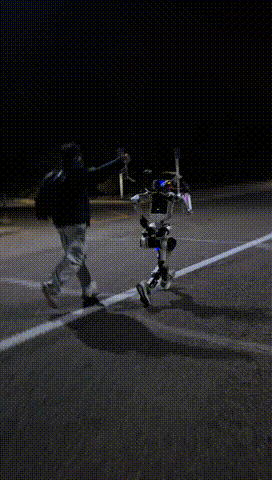
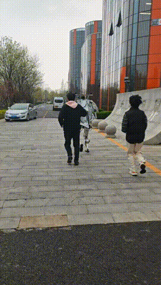
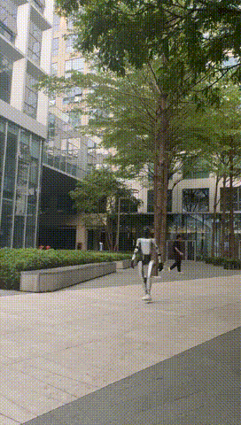
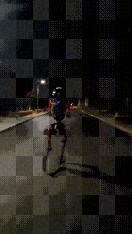

# Marathongo

English | [中文](README.md)

`Marathongo` is an open-source full-stack navigation framework for humanoid robot marathon scenarios, focusing on high-speed, stable, and autonomous operation in large-scale outdoor environments.

We are a company focused on embodied intelligence, with deep engineering experience in localization, navigation, and robot system integration. The goal of open-sourcing this repository is not to publish a single algorithm demo, but to share a battle-tested, extensible, and adaptable framework so that robotics researchers and industry partners can bring up their own robots faster.

This repository emphasizes several core strengths:

- Robust localization and navigation for large-scale outdoor environments.
- Multiple technical routes, from minimal solutions to more complex full-system implementations.
- Collaboration across vision, LiDAR, localization, planning, and control.
- Designed for real robot adaptation and close to out-of-the-box use.
- Broadly open-sourced code, training assets, and deployment-related components.

## Showcase

The following GIFs show selected runtime examples of `Marathongo` across different robot platforms, day and night environments, and scenarios such as line following, high-speed running, and obstacle avoidance.

  
  
  

  
  
  

  
  

  

## Project Positioning

Humanoid robot marathons are not just path tracking problems. They usually involve several challenges at the same time:

- Long outdoor routes where localization drift cannot keep accumulating.
- High-speed motion that demands both stability and real-time performance.
- Track boundaries mixed with temporary obstacles, robot interference, and partial occlusions.
- Strong heterogeneity across robot platforms, sensors, control interfaces, and motion capabilities.

`Marathongo` was built in exactly this context. It tries to answer a more practical engineering question:

**How can different humanoid robots be adapted more quickly to a proven navigation framework that works reliably in large-scale outdoor high-speed tasks?**

## What Is Inside This Repository

At a high level, the repository is composed of the following parts:

### 1. `glio_mapping`

A robust localization and mapping module for large-scale outdoor environments. It is one of the most critical foundations of the whole system.

It mainly addresses:

- Global consistency and localization stability during long-distance operation.
- Fusion of GNSS, IMU, LiDAR, and other sensing sources.
- Robustness under dynamic outdoor environments, slopes, occlusions, and local degeneracy.

If your focus is on how a robot can maintain reliable localization over tens of minutes and many kilometers outdoors, `glio_mapping` is one of the core capabilities of this repository.

### 2. `tangent_arc_navigation`

This is a more minimal, lightweight, easy-to-understand, and quick-to-adapt technical route, mainly for line following and basic obstacle avoidance.

Its characteristics are:

- A relatively simple system structure, suitable for quick bring-up and prototyping.
- Good line-following performance, making it useful for users who want to close the loop quickly.
- Basic obstacle avoidance capability, though its obstacle handling still has room for further tuning.

If your goal is to validate the full robot navigation loop with lower complexity first, this route is a more direct starting point.

### 3. `marathontracking`

This is a more complete, more complex, and more engineering-oriented route for line following and obstacle avoidance.

It includes more complete local planning, control, and system integration logic, and is suitable for:

- Scenarios with higher demands on real competition performance.
- Users who need more sophisticated obstacle handling strategies.
- Teams that want to keep optimizing planning, control, and system coordination on top of an existing framework.

Compared with the minimal route, `marathontracking` is closer to a full navigation framework for real-world deployment.

### 4. `vision_part`

This is the vision perception part of the repository, including data, training, and deployment code related to obstacle recognition.

Its key characteristics include:

- Vision-based obstacle recognition for robot scenarios.
- Open training pipelines related to our self-collected dataset.
- Deployment and inference code that can be further integrated into user systems.

One important note is that the final online fusion between vision and navigation still depends on calibration and system integration on the target robot platform. In other words, **we open-source the training and deployment-related capabilities, but users still need to complete calibration and fusion integration for their own hardware.**

## Why We Keep Multiple Technical Routes

In real robot projects, there is rarely one single correct navigation solution. Different teams usually face different constraints, such as:

- Different compute budgets.
- Different sensor combinations.
- Different race strategies.
- Different control accuracy and dynamic performance.
- Different priorities between "fast bring-up" and "higher upper-bound performance".

For that reason, `Marathongo` does not force everything into one single route. Instead, it keeps:

- A minimal route represented by `tangent_arc_navigation`.
- A more advanced route represented by `marathontracking`.
- A robust localization backbone represented by `glio_mapping`.
- A multimodal perception extension represented by `vision_part`.

This organization is more useful for the open-source community. Researchers can pick only the parts that fit their own platforms, or combine multiple routes into a complete system.

## Who This Repository Is For

This repository is especially suitable for:

- Researchers who want to adapt their own humanoid robot platforms quickly.
- Universities and research labs working on high-speed humanoid robot navigation.
- Engineering teams building competition-oriented or long-range outdoor autonomous systems.
- Developers who want to study how a real system is organized, rather than only isolated algorithm modules.

If you already have a basic robot software environment and want to reduce the cost of building a navigation stack from scratch, this repository can be a valuable reference.

## Key Advantages

### Robust Large-Scale Outdoor Localization

Reliable outdoor long-range navigation starts from reliable localization. `glio_mapping` reflects our accumulated experience in the localization stack and is a key reason why the overall system can work in real competition scenarios.

### Multiple Technical Routes

The same task is covered by both minimal and more complex implementations, allowing different teams to choose based on resources, time, and target performance rather than being locked into one approach.

### Multimodal Collaboration

The repository includes not only localization and navigation, but also visual obstacle recognition, training pipelines, and deployment paths for building a more complete multimodal system.

### Designed for Adaptation

We have implemented adaptation logic for multiple robot platforms. The core goal is to make it easier for users to migrate this framework onto their own robots.

### Close to Out-of-the-Box

We try to expose key parts of the system as completely as possible, so users do not only get paper ideas or scattered scripts, but a more complete engineering implementation.

## Reading Guide

This `README` only introduces `Marathongo` at the overall project level.

If you are already interested in a specific capability, we recommend reading the corresponding subproject documents:

- `glio_mapping/README.md`
- `marathontracking/README.md`
- `tangent_arc_navigation/src/README.MD`
- `vision_part/seg_fusion/README.md`
- `vision_part/seg_tensorrt/README.md`

Each subproject provides more detailed information about environment setup, dependencies, usage, reproduction, or module-specific details.

## Open-Source Notes

We hope this repository can serve as a practical and realistic reference base for the robotics community. You are welcome to trim, replace, and extend the localization, planning, control, perception, and integration parts according to your own platform.

Please note that different robot platforms may differ significantly in:

- Sensor models and extrinsic relationships.
- Control interfaces and low-level actuator capabilities.
- Kinematics and dynamic constraints.
- Computing platforms and real-time budgets.
- Safety strategies and competition rules.

Therefore, open-source code should not be understood as zero-modification compatibility with all robot platforms. In real deployment, please complete the necessary engineering adaptation, calibration, and safety validation based on your own hardware conditions.

## Code Status And Usage Notes

It is important to mention that this repository is mainly an engineering codebase accumulated through real projects and long-term debugging.

Because of that, you may notice obvious traces of iterative development, such as:

- Scripts, configs, and directory layouts with stage-specific experimental characteristics.
- Inconsistent coding styles, naming patterns, and commenting habits across different modules.
- Implementations that prioritize "actually runnable, easy to validate, and easy to adapt" over product-grade abstraction and full consistency.

This is something we want to make explicit when open-sourcing the repository: **it is first a practical framework refined in real scenarios, and only second a polished showcase codebase with fully unified style.**

If you find the code somewhat difficult to read, migrate, or adapt, that is normal. We recommend combining:

- The submodule README files together with the source code.
- A targeted review of your own robot's sensors, control interfaces, and system pipeline.
- AI-assisted tools to analyze and explain the code structure, module responsibilities, dependencies, and adaptation points.

For a codebase of this size, with strong engineering characteristics and visible historical debugging traces, AI assistance can significantly improve onboarding efficiency. We also welcome further engineering cleanup and refinement from the community.

## Acknowledgements

This repository references, learns from, and benefits from many excellent open-source works in robotics. We sincerely thank the corresponding authors and communities.

Some representative examples that have been particularly important to this project include, but are not limited to:

- `FAST-LIO`
- `FAST-LIO-SAM`
- `LIO-SAM`
- `IKFoM`
- `ikd-Tree`
- `costmap_converter`
- `TensorRT`

In addition, parts of this repository may contain code that has been reorganized, adapted, refactored, or engineering-integrated on top of other open-source projects. For more specific references, dependencies, and notices, please refer to the documentation, source comments, and license files inside each subproject.

## Disclaimer

This repository is intended to promote academic research, engineering exchange, and faster robot system development, but it does not provide any explicit or implicit warranty regarding:

- Direct usability on arbitrary hardware platforms.
- Stable performance under all environments, race tracks, weather conditions, or dynamic crowd scenarios.
- Automatic compliance with any particular commercial use case, regulatory requirement, or safety standard.

Robot systems interact with the physical world and may involve real safety risks. Please evaluate safety carefully before using this repository, and complete the necessary simulation, empty-field testing, speed-limited validation, and emergency strategy design before deploying on real hardware.

## Copyright And Content Notice

We respect the legitimate rights of the open-source community and all relevant right holders, and we take the sources and copyright status of code, documents, data, models, images, and other repository content seriously.

If you believe any content in this repository involves one of the following issues:

- Missing or inaccurate copyright attribution.
- Incomplete acknowledgement of references, reuse, or dependencies.
- Data, models, code, or documentation affecting your legitimate rights.

Please contact us through repository `Issues` or the maintainer contact information. After verification, we will handle it as soon as possible, including but not limited to:

- Adding source attribution and copyright statements.
- Correcting related documentation.
- Adjusting attribution or citation style.
- Taking down or removing disputed content.

## Contributions

We welcome researchers, developers, and industry partners in robotics to build on top of this repository. We especially welcome contributions in the following directions:

- Adaptation for new robot platforms.
- Sensor driver and interface integration.
- Improvements to localization, perception, planning, and control modules.
- Documentation enhancement and engineering cleanup.
- Benchmarks, test assets, and additional case studies.

If this repository is helpful to you, feel free to follow it, cite it, report issues, and contribute back.
